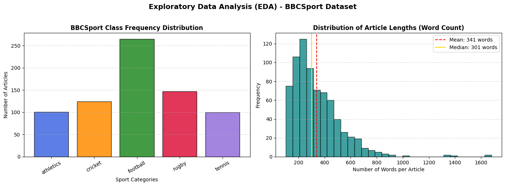
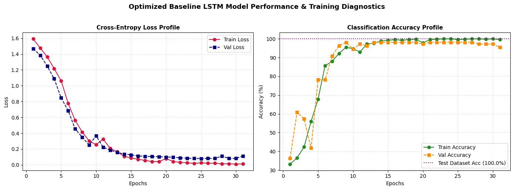
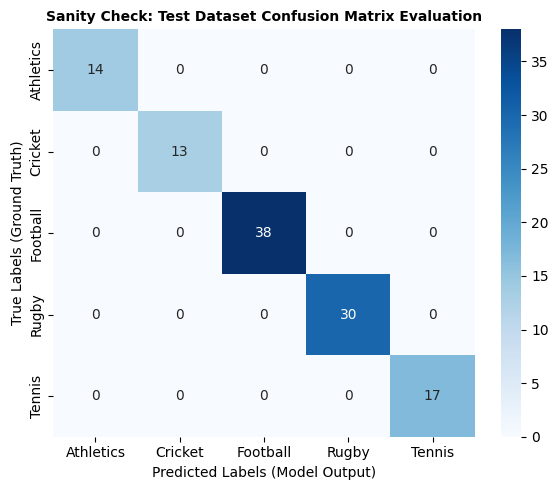
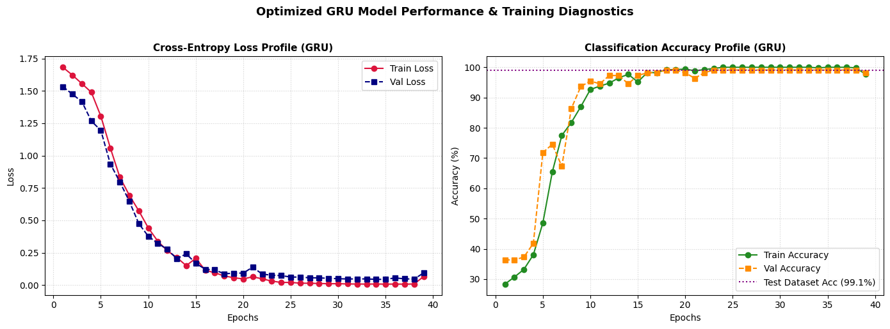
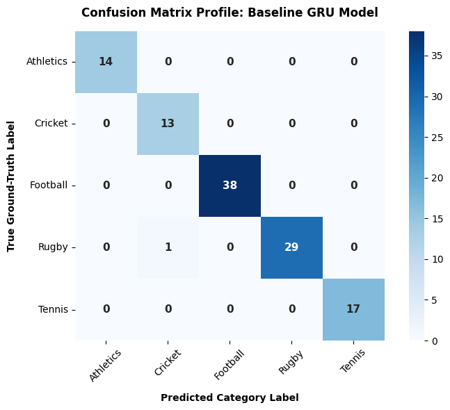

# 🏆 Sports Text Classification using Advanced RNNs (LSTM & GRU)
> **تحلیل مقایسه‌ای معماری‌های بازگشتی LSTM و GRU در طبقه‌بندی هوشمند متون خبری**

---

## 🌐 Language Navigation / ناوبری زبان
* [English Version](#english-version)
* [نسخه فارسی](#نسخه-فارسی)

---

# English Version

## 📝 Project Overview
This repository contains a production-grade NLP pipeline designed to classify sports news articles into 5 distinct categories (*Athletics, Cricket, Football, Rugby, Tennis*) using the **BBCSport** dataset. The project shifts from vanilla text classification to a deep structural comparison between **LSTM** and **GRU** architectures, heavily focusing on **Out-of-Distribution (OOD) Generalization** and **Ablation Studies**.

### ✨ Key Features
* **Advanced Text Preprocessing**: Customized tokenization, low-frequency word filtration, and `<UPPER>` token tracking for proper nouns.
* **Smart Padding Strategy**: Pre-padding implementation to maximize hidden state signal integration at the classification head.
* **Feature Extraction**: Temporal Global Max Pooling layer to capture the strongest semantic triggers independently of their position.
* **Dynamic Training**: Real-time memory/RAM tracking, Early Stopping, and `ReduceLROnPlateau` scheduling.
* **Robust Evaluation**: Standard in-distribution validation alongside a rigorous 30-sample Out-of-Distribution (OOD) stress test.

---

## 📊 Dataset Profile & Preprocessing (EDA)
The BBCSport dataset consists of **737 documents**. Through Exploratory Data Analysis, we uncovered a clear class imbalance dominated by football articles (36%).

| Class ID | Class Name | Sample Count | Percentage |
| :---: | :--- | :---: | :---: |
| 0 | Athletics | 101 | 13.7% |
| 1 | Cricket | 124 | 16.8% |
| 2 | Football | 265 | 36.0% |
| 3 | Rugby | 147 | 19.9% |
| 4 | Tennis | 100 | 13.6% |


```

Text Length Metrics:
🔹 Min Words: 104 | 🔸 Max Words: 1680 | 🔹 Average Words: 341 -> Optimal MAX_LEN Set to: 567

```

<p align="center">
  
</p>

---

## 🧠 Model Architectures & Hyperparameters

Both models leverage an initial **300-dimensional continuous Embedding space** followed by a hidden size of **256 units**.

1. **LSTM Baseline**: Implements a 4-gate control mechanism (Input, Forget, Cell, Output) with a `Dropout` rate of `0.4`.
2. **Optimized GRU**: A compact 2-gate cell (Reset, Update) utilizing a slightly stronger `Dropout` rate of `0.5` to avoid parameter overfitting.

### ⚙️ Training Configurations
* **Optimizer**: Adam ($\eta = 0.001$, $\text{weight\_decay} = 1\times10^{-5}$)
* **Loss Function**: CrossEntropyLoss
* **Batch Size**: 32 (Reproducible splitting: 70% Train, 15% Val, 15% Test)

---

## 📈 Performance & Evaluation

### 1. LSTM Architecture Results
The LSTM model demonstrates stable convergence, achieving peak performance within 31 epochs due to the dynamic learning rate scheduler.

<p align="center">
  
</p>

The in-distribution confusion matrix confirms perfect classification behavior across the test partition:

<p align="center">
  
</p>

### 2. GRU Architecture Results
The optimized GRU model converges efficiently over 40 epochs, matching the baseline with a much lighter parameter footprint.

<p align="center">
  
</p>

The corresponding confusion matrix maps the structural accuracy achieved on the test dataset:

<p align="center">
  
</p>

---

### 🔬 Comparative Summary
| Metric | LSTM Baseline | Optimized GRU |
| :--- | :---: | :---: |
| **Trainable Parameters** | 3,294,277 | **3,151,429 (Lighter)** |
| **In-Distribution Test Accuracy** | **100.00%** | 99.11% |
| **Out-of-Distribution (OOD) Stress Test** | 36.67% | **40.00% (More Robust)** |

### 🔍 Error & OOD Bias Analysis
During the 30-sample **Out-of-Distribution (OOD) Stress Test**, both models experienced performance degradation, revealing a systematic **majority class bias towards Football**. When faced with structurally ambiguous or unfamiliar texts, the networks dynamically map hidden states to the class containing the strongest statistical weight priors from training.

---

## 🧪 Ablation Study
We isolated the `MAX_LEN` hyperparameter in the GRU model to measure the structural decay of text truncation:
* **Sequence Length = 100**: Crucial contextual signals were truncated, dropping accuracy to **83.93%**.
* **Sequence Length = 700**: Accuracy scaled to **89.29%**, but triggered a linear increase in GPU computation times.
* **Conclusion**: Our selected `MAX_LEN = 567` serves as the optimal **Sweet Spot** balancing RAM utilization and feature integrity.

---

# نسخه فارسی

## 📝 مرور اجمالی پروژه
این مخزن حاوی یک خط‌لوله (Pipeline) پردازش زبان طبیعی در سطح صنعتی است که برای طبقه‌بندی مقالات خبری ورزشی به ۵ دسته مجزا (*دو و میدانی، کریکت، فوتبال، راگبی، تنیس*) با استفاده از داده‌های **BBCSport** طراحی شده است. تمرکز اصلی این پژوهش بر مقایسه ساختاری عمیق میان دو معماری بازگشتی **LSTM** و **GRU**، ارزیابی **تعمیم‌پذیری خارج از توزیع (OOD)** و **مطالعات حذف (Ablation)** است.

### ✨ ویژگی‌های کلیدی
* **پیش‌پردازش پیشرفته متون**: توکنایزیشن اختصاصی، فیلتر کلمات کم‌تکرار و ردیابی تگ `<UPPER>` برای حفظ ارزش معنایی اسامی خاص.
* **پدینگ معکوس هوشمند**: اعمال استراتژی Pre-padding جهت جلوگیری از تضعیف سیگنال‌های معنایی در گام‌های پایانی شبکه بازگشتی.
* **استخراج ویژگی پویا**: بهره‌گیری از لایه Temporal Global Max Pooling برای شکار قوی‌ترین نشانه‌های متنی مستقل از موقعیت قرارگیری.
* **پایش تلمتری سیستم**: ردیابی لحظه‌ای مصرف حافظه رم (RAM)، زمان‌بندی پویا با `ReduceLROnPlateau` و مکانیزم توقف زودرس.

---

## 📊 پروفایلینگ داده‌ها و پیش‌پردازش (EDA)
مجموعه داده حاوی **۷۳۷ سند متنی** است. تحلیل‌های آماری نشان‌دهنده ناهمگونی و عدم توازن کلاس‌ها با محوریت کلاس فوتبال (۳۶٪ کل داده‌ها) می‌باشد.


```

شاخص‌های طول متن:
🔹 حداقل کلمات: 104 | 🔸 حداکثر کلمات: 1680 | 🔹 میانگین کلمات: 341 -> طول توالی بهینه (MAX_LEN): 567

```

---

## 🧠 معماری شبکه‌ها و هایپرپارامترها

هر دو مدل از یک لایه تعبیه‌سازی اولیه با **ابعاد ۳۰۰** و **لایه پنهان با ابعاد ۲۵۶** استفاده می‌کنند.

۱. **مدل پایه LSTM**: مجهز به ۴ گیت کنترلی استاندارد و لایه تنظیم‌کننده `Dropout` با نرخ `0.4`.
۲. **مدل بهینه‌شده GRU**: دارای سلول‌های فشرده‌تر ۲ گیتی (Update, Reset) با نرخ `Dropout` برابر با `0.5` جهت مقابله با بیش‌برازش پارامتریک.

---

## 📈 ارزیابی عملکرد و نتایج تجربی

### ۱. نتایج معماری LSTM
مدل LSTM همگرایی پایداری را نشان می‌دهد و به لطف کاهش پویای نرخ یادگیری، در اپوک ۳۱ به بهینه‌ترین حالت خود می‌رسد. ماتریس خطای زیر صحت عملکرد ۱۰۰ درصدی این مدل را بر روی داده‌های تست داخلی تایید می‌کند.

### ۲. نتایج معماری GRU
مدل GRU بهینه‌سازی شده در طی ۴۰ اپوک آموزش دیده و توانسته است با تعداد پارامترهای کمتر، ساختاری بسیار رقابتی ارائه دهد که جزئیات آن در نمودارها و ماتریس خطای مربوطه مشهود است.

---

### 🔬 جدول مقایسه نتایج نهایی
| شاخص ارزیابی | شبکه عصبی LSTM | شبکه عصبی GRU |
| :--- | :---: | :---: |
| **تعداد پارامترهای آموزش‌پذیر** | ۳,۲۹۴,۲۷۷ | **۳,۱۵۱,۴۲۹ (سبک‌تر)** |
| **دقت روی داده‌های آزمون داخلی** | **۱۰۰.۰۰٪** | ۹۹.۱۱٪ |
| **دقت در تست استرس خارج از توزیع (OOD)** | ۳۶.۶۷٪ | **۴۰.۰۰٪ (مقاوم‌تر)** |

### 🔍 تحلیل خطا و بایاس سیستماتیک
در طی تست استرس با ۳۰ نمونه متنی کاملاً مستقل و خارج از توزیع دیتابیس (OOD)، مدل‌ها دچار افت عملکرد شدند. ماتریس‌های خطا فاش کردند که رفتار مدل‌ها کاملاً متمایل به **بایاس به سمت کلاس اکثریت (فوتبال)** است. این امر اثبات می‌کند که شبکه‌های بازگشتی در شرایط ابهام زبانی، به صورت پیش‌فرض به سمت کلاسی متمایل می‌شوند که وزن آماری بیشتری در فاز آموزش داشته است.

---

## 🧪 مطالعه حذف (Ablation Study)
با جداسازی هایپرپارامتر طول توالی در مدل GRU، اثرات تجربی محدودسازی متن بررسی شد:
* **طول توالی = ۱۰۰**: به دلیل قطع اطلاعات حیاتی، دقت مدل به سرعت به **۸۳.۹۳٪** کاهش یافت.
* **طول توالی = ۷۰۰**: دقت به **۸۹.۲۹٪** ارتقا یافت، اما بار محاسباتی هسته‌های CUDA به شکل خطی سنگین‌تر شد.
* **نتیجه**: طول توالی **۵۶۷** به عنوان نقطه تعادل بهینه محاسبات و دقت تعیین شد.

---

👨‍💻 **Authors / توسعه‌دهندگان**: Developed as an academic and deep learning benchmark project.

```
